# IDGX Custody — Use Case Flows

## 1. Quy ước và phạm vi

- **Client-side:** Root, Admin, Operator, Viewer của tổ chức sử dụng dịch vụ.
- **Custody-side:** Back-office Admin, Custody Operations, Compliance, Auditor.
- Các tỷ lệ, ngưỡng và quorum: `hot 5% / warm 15% / cold 80%`, KYT high-risk từ `80`, và phê duyệt rút tiền bởi `2` người khác nhau.

| ID | Business use case | Ghi chú chính |
|---|---|---|
| UC-01 | Onboarding tổ chức và phân quyền | Có mô hình Client, User, role và scope; onboarding/KYB và mời người dùng chưa có workflow |
| UC-02 | Khai báo, sàng lọc và whitelist ví nhận | Có RBAC, KYT và trạng thái `WHITELISTED`/`REVIEW_REQUIRED`; xử lý manual review chưa hoàn chỉnh |
| UC-03 | Nhận tiền, xác nhận và ghi có | Có pending, số confirmation theo tài sản, chống ghi có lặp và KYT đầu vào |
| UC-04 | Sweep và phân bổ hot/warm/cold | Sweep về omnibus và tái cân bằng 5/15/80; cold storage vật lý là mô phỏng |
| UC-05 | Rút tiền có kiểm soát | Whitelist, KYT, hạn mức, khóa số dư, Travel Rule, dual approval, quorum signing, broadcast |
| UC-06 | Xử lý lệnh đa chuỗi | Có BTC, EVM, SOL, XRP; RPC/signing production chưa có |
| UC-07 | Staking và quản lý lợi suất | Có tạo vị thế và ledger accounting; chưa có approval, validator execution, reward/unstake lifecycle |
| UC-08 | RWA issuance, investor eligibility và custody | Có contract testnet, allowlist, mint, custody deposit/withdrawal; pháp lý/reserve operations là off-chain |
| UC-09 | Reconciliation và xử lý chênh lệch | Có đối chiếu 3 số liệu và phát hiện break; chưa có case-management/remediation workflow |
| UC-10 | Audit, báo cáo và điều tra | Có hash-chained audit log; dashboard/reporting và evidence workflow chưa đầy đủ |
| UC-11 | Xử lý sự cố an toàn tài sản | Requirement đòi hỏi incident response; demo chưa có orchestration |

## 2. Bản đồ nghiệp vụ tổng thể

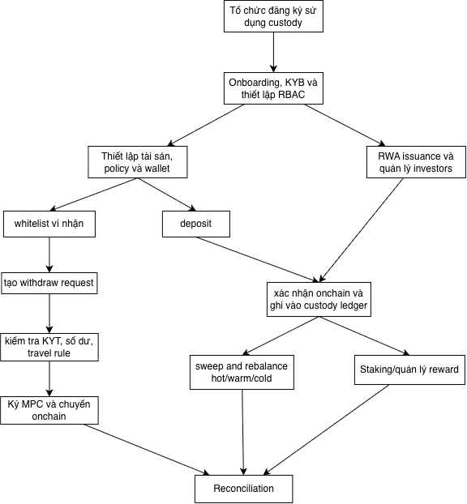

## 3. UC-01 — Onboarding tổ chức và thiết lập quyền truy cập

- **Mục tiêu:** chỉ tổ chức đã hoàn tất KYB/KYC và được cấu hình đúng chính sách mới có thể sử dụng custody.
- **UBO — Ultimate Beneficial Owner:** chủ sở hữu hưởng lợi cuối cùng

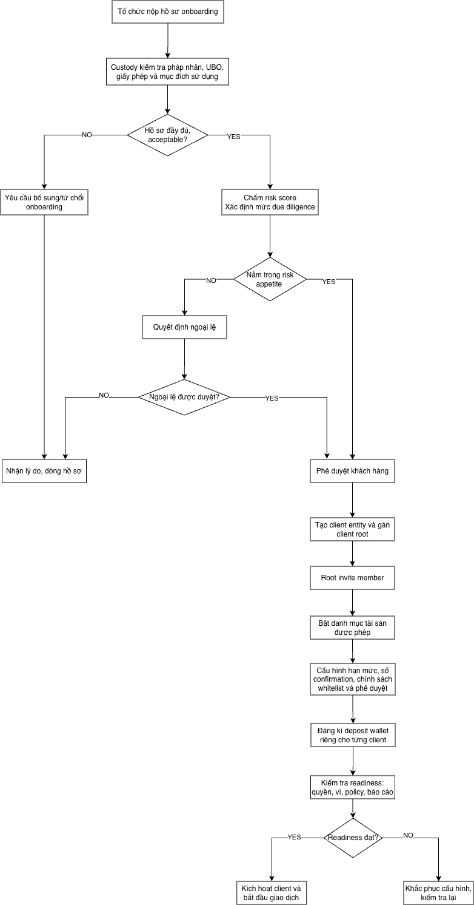 

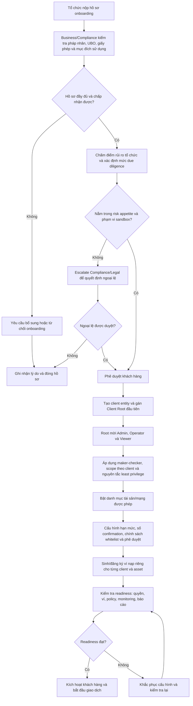

**Điểm kiểm soát nghiệp vụ**

1. Client user không được nhìn hoặc thao tác dữ liệu của client khác.
2. Root/Admin quản trị người dùng và whitelist; Operator tạo giao dịch; Viewer chỉ đọc.
3. Quyền back-office phải tách khỏi quyền client. Production nên tách thêm Approver, Wallet Operator và Broadcaster; demo hiện dùng chung `BACKOFFICE_ADMIN`.
4. Phần KYB/KYC, invitation, MFA, user lifecycle và readiness gate là **TO-BE**; demo hiện seed sẵn client/user.

## 4. UC-02 — Khai báo, KYT và whitelist ví nhận

**Mục tiêu:** chỉ cho phép rút tiền đến đúng ví, đúng tài sản và đã qua kiểm soát rủi ro.

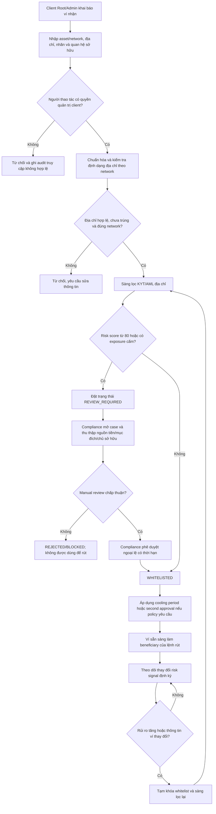

**Trạng thái đề xuất:** `DRAFT → SCREENING → WHITELISTED`, hoặc `SCREENING → REVIEW_REQUIRED → WHITELISTED/REJECTED`, và `WHITELISTED → SUSPENDED` khi tái sàng lọc phát hiện rủi ro.

**Khoảng trống production:** demo đã có RBAC, KYT và `REVIEW_REQUIRED`, nhưng chưa có manual-review resolution, cooling period, re-screening, expiry và network-format validation hoàn chỉnh.

## 5. UC-03 — Nhận tài sản, xác nhận on-chain và ghi có

**Mục tiêu:** phát hiện tiền vào nhưng chỉ làm tăng số dư khả dụng sau khi vượt qua KYT và đạt finality theo từng tài sản.

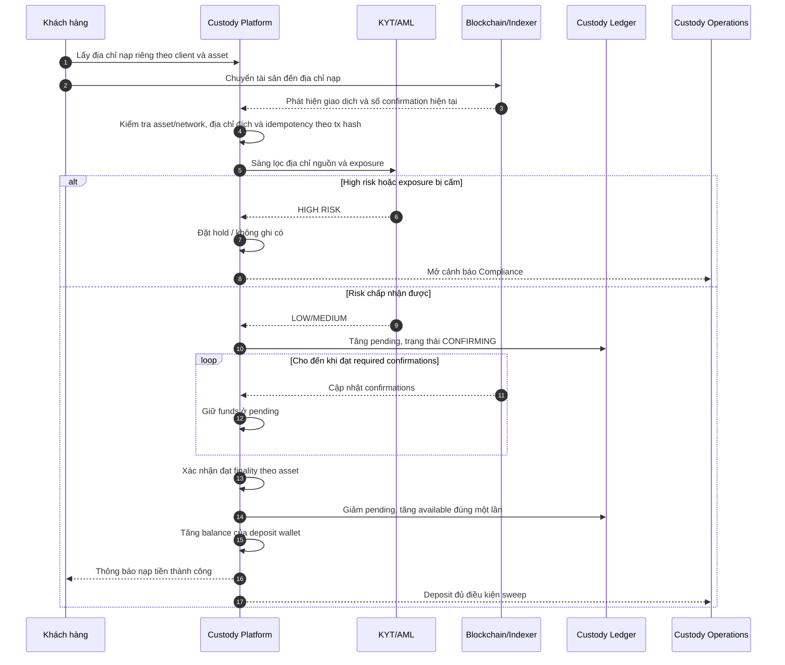

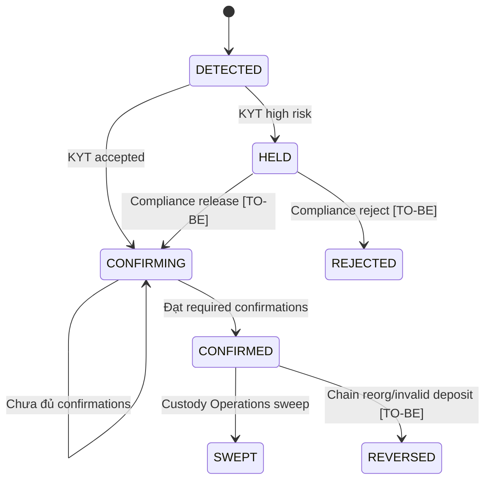

**Quy tắc quan trọng**

1. Phát hiện giao dịch chỉ làm tăng `pending`; không được tăng `available` trước finality.
2. Số confirmation là cấu hình theo asset: demo seed BTC 3, ETH/AVAX 12, SOL/XRP 1, POL 128.
3. Confirmation chỉ tăng theo giá trị lớn nhất đã quan sát; gọi xác nhận lặp sau khi `CONFIRMED` không được ghi có thêm lần nữa.
4. KYT high-risk bị chặn trước khi tạo nghĩa vụ phải trả cho client.
5. Production cần xử lý reorg, wrong-network/wrong-token, memo/tag thiếu, chain outage, late detection và manual release của deposit hold.

## 6. UC-04 — Sweep và quản lý thanh khoản hot/warm/cold

**Mục tiêu:** thu gom tài sản khỏi ví nạp, duy trì thanh khoản vận hành và đảm bảo tối thiểu 80% nằm trong tầng cold theo requirement.

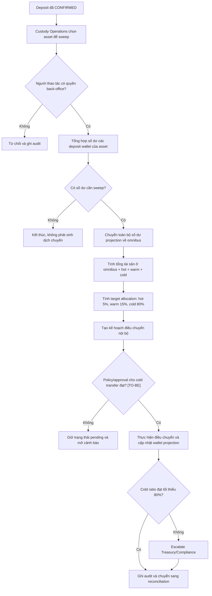

### Bổ sung thanh khoản khi rút tiền

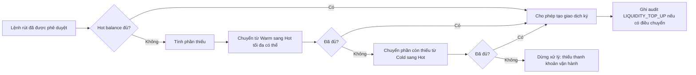

**Lưu ý:** demo cập nhật số dư wallet projection trong database. Production cần workflow ký/chuyển thật, approval riêng cho cold withdrawal, time lock, air-gapped ceremony, fee reserve và reconciliation với chain độc lập.

## 7. UC-05 — Rút tài sản có dual approval và ký quorum

**Mục tiêu:** ngăn rút sai người, sai ví hoặc vượt policy; tách người tạo lệnh, người phê duyệt và người thực thi.

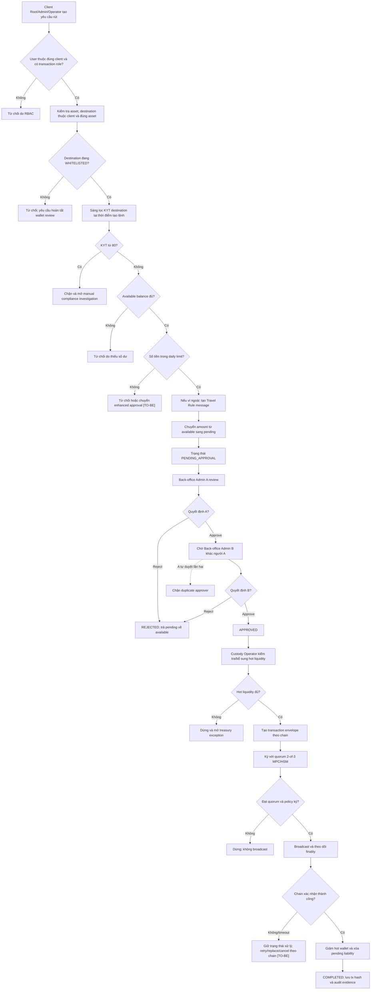

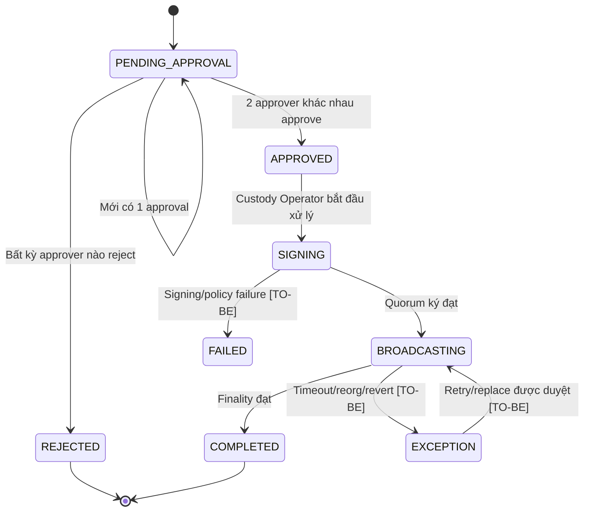

**Phân tách nhiệm vụ đề xuất**

| Giai đoạn | Vai trò tạo/kiểm soát | Không nên kiêm nhiệm |
|---|---|---|
| Khởi tạo lệnh | Client Root/Admin/Operator | Back-office approver của chính lệnh |
| Phê duyệt 1 | Back-office Approver A | Approver B |
| Phê duyệt 2 | Back-office Approver B | Approver A |
| Chuẩn bị/broadcast | Wallet Operator/Broadcaster | Người giữ đủ quorum ký một mình |
| Giám sát và hậu kiểm | Auditor/Compliance | Người sửa dữ liệu giao dịch |

## 8. UC-06 — Xử lý lệnh chuyển tài sản đa chuỗi

**Mục tiêu:** giữ nguyên một quy trình phê duyệt kinh doanh, nhưng áp dụng đúng quy tắc giao dịch/finality của từng blockchain.

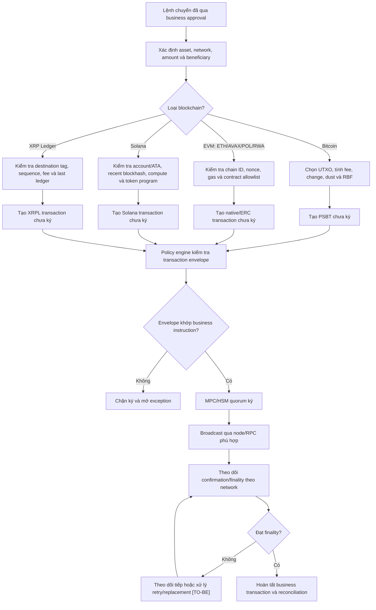

**Ranh giới kiến trúc:** người dùng nghiệp vụ không cần biết adapter hoặc endpoint nào được gọi. Họ chỉ cần thấy cùng một lệnh rút, cùng policy/approval, trạng thái thực thi rõ ràng và bằng chứng finality nhất quán.

## 9. UC-07 — Staking và quản lý lợi suất

**Mục tiêu:** cho phép tổ chức đưa tài sản đủ điều kiện vào staking mà vẫn tách biệt available, staked, reward và withdrawal/unbonding.

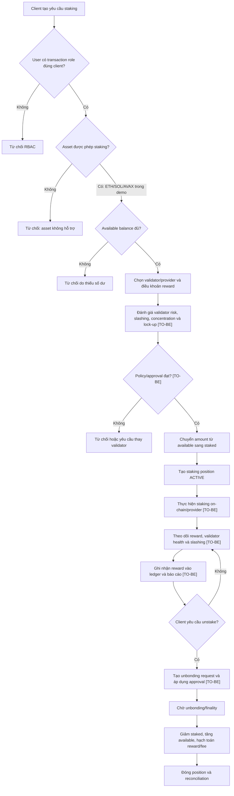

**AS-IS:** dự án mới thực hiện đến bước tạo `ACTIVE` position và chuyển số dư `available → staked`. Phần provider execution, reward accrual, slashing, unbonding và settlement là **TO-BE**.

## 10. UC-08 — RWA issuance, investor eligibility và custody lifecycle

**Mục tiêu:** phát hành tài sản token hóa có kiểm soát, chỉ cho nhà đầu tư đủ điều kiện nắm giữ/chuyển nhượng, đồng thời đưa token vào custody ledger chuẩn.

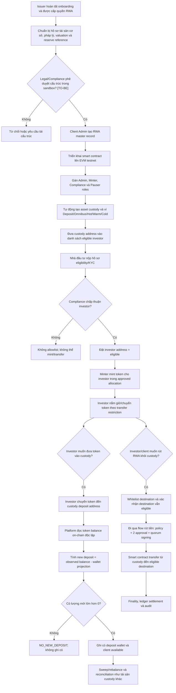

### Kiểm soát vòng đời RWA

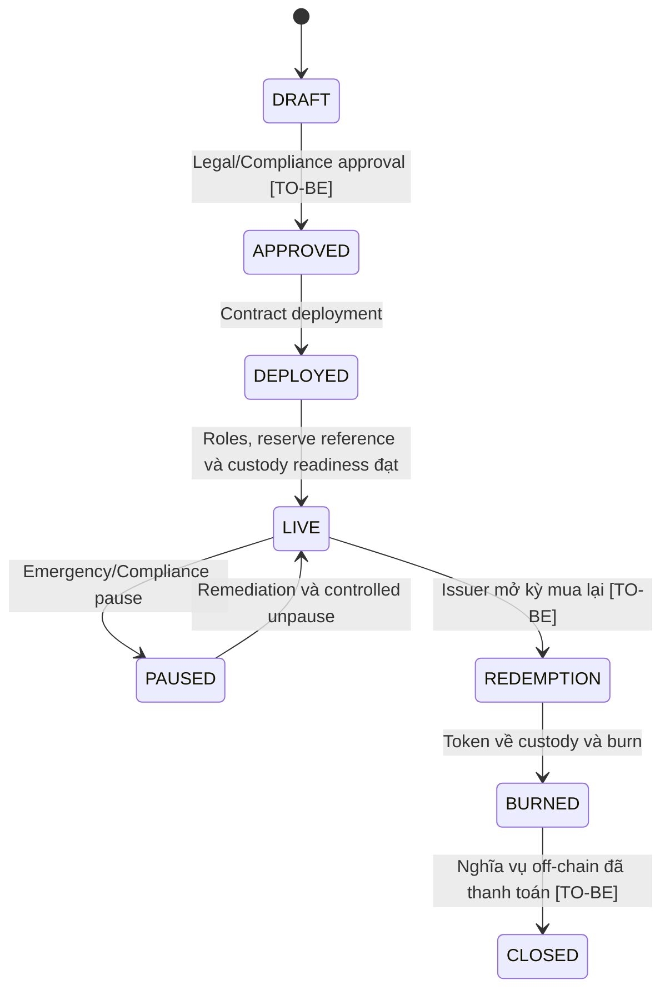

**Điểm cần giữ ngoài smart contract:** quyền sở hữu pháp lý, kiểm chứng reserve, valuation, corporate actions, cash settlement, regulatory reporting và phê duyệt sandbox. Contract demo chỉ chứng minh role separation, eligible investor, transfer restriction, pause, mint/burn và reserve reference.

## 11. UC-09 — Reconciliation và xử lý chênh lệch

**Mục tiêu:** chứng minh tài sản quan sát độc lập trên chain khớp cả wallet projection lẫn tổng nghĩa vụ với client.

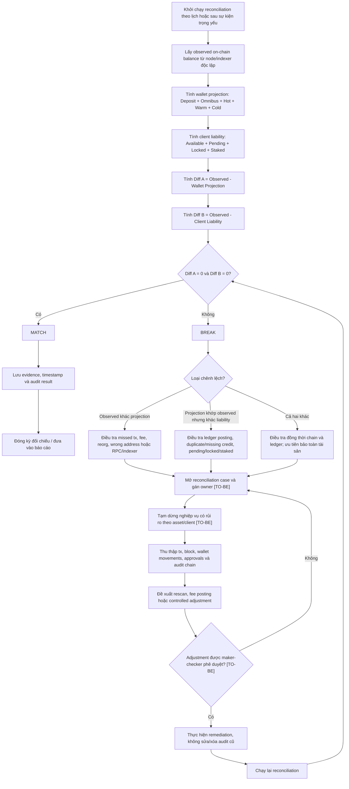

**AS-IS:** dự án tính đủ ba tổng và hai difference, trả `MATCH` hoặc `BREAK`. Case management, freeze, maker-checker adjustment, evidence package và SLA xử lý break là **TO-BE**.

## 12. UC-10 — Audit trail, báo cáo và điều tra

**Mục tiêu:** mọi quyết định và biến động tài sản phải truy nguyên được; sửa một bản ghi cũ phải làm đứt chuỗi bằng chứng.

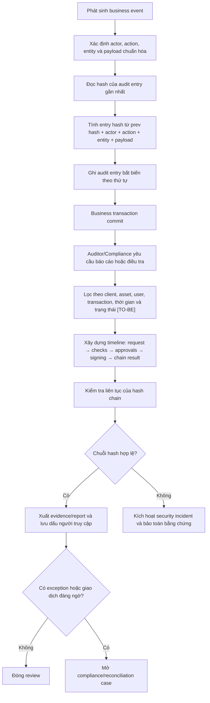

**Các report business nên có trong Q3 target:** asset position theo client/entity, pending deposits, withdrawal approval aging, whitelist/KYT exceptions, hot-warm-cold ratio, reconciliation breaks, RWA investor/holding activity, staking position/reward, user access và audit integrity.

## 13. UC-11 — Xử lý sự cố an toàn tài sản (TO-BE)

**Mục tiêu:** khi có dấu hiệu compromise, ưu tiên ngăn thất thoát, bảo toàn bằng chứng, đáp ứng nghĩa vụ thông báo và chỉ mở lại sau reconciliation độc lập.

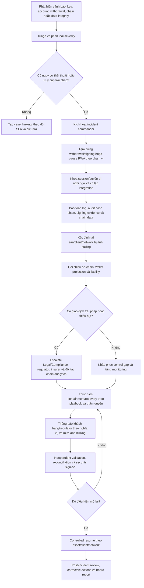

## 14. Các trạng thái dữ liệu

| Aggregate | Trạng thái |
|---|---|
| Client | `ONBOARDING`, `UNDER_REVIEW`, `ACTIVE`, `SUSPENDED`, `OFFBOARDED` |
| User | `INVITED`, `ACTIVE`, `LOCKED`, `DISABLED` |
| Wallet beneficiary | `DRAFT`, `SCREENING`, `REVIEW_REQUIRED`, `WHITELISTED`, `SUSPENDED`, `REJECTED` |
| Deposit | `DETECTED`, `HELD`, `CONFIRMING`, `CONFIRMED`, `SWEPT`, `REVERSED` |
| Withdrawal | `PENDING_APPROVAL`, `REJECTED`, `APPROVED`, `SIGNING`, `BROADCASTING`, `COMPLETED`, `EXCEPTION`, `FAILED` |
| Staking position | `REQUESTED`, `APPROVED`, `BONDING`, `ACTIVE`, `UNBONDING`, `CLOSED`, `SLASHED` |
| RWA | `DRAFT`, `APPROVED`, `DEPLOYED`, `LIVE`, `PAUSED`, `REDEMPTION`, `BURNED`, `CLOSED` |
| Reconciliation case | `OPEN`, `INVESTIGATING`, `PENDING_ADJUSTMENT_APPROVAL`, `REMEDIATED`, `CLOSED` |
| Security incident | `TRIAGE`, `CONTAINED`, `INVESTIGATING`, `RECOVERING`, `MONITORING`, `CLOSED` |

